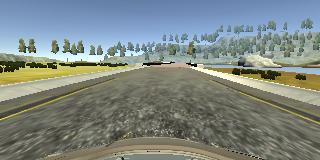
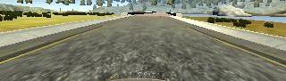
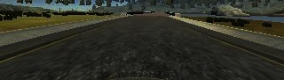

**Behavioral Cloning Project**

#### 1. Submission includes all required files and can be used to run the simulator in autonomous mode

My project includes the following files:
* model.py containing the script to create and train the model
* drive.py for driving the car in autonomous mode (as provided by Udacity and modified to suit the model's input size)
* model.h5 containing a trained convolution neural network in Keras 
* video.mp4 containing a one lap video of the car driving on the path 
* writeup_report.md or writeup_report.pdf summarizing the workflow and the results

#### 2. Submission includes functional code
Using the Udacity provided simulator and my drive.py file, the car can be driven autonomously around the track by executing 
```sh
source activate carnd-term1
cd (change to directory)
python drive.py model.json
```
#### 3. Submission code is usable and readable

The model.py file contains the code for training and saving the convolution neural network. The file shows the model I used - Nvidia End to End Deep Learning for Self Driving Cars (https://arxiv.org/pdf/1604.07316v1.pdf), with the slight addition of 'Dropout' layers to reduce overfitting as compared to using training and validation sets. 

### Model Architecture and Training Strategy

I used the popular Nvidia SDC model. It has 3 successive '5 x 5' filter layers, followed by 2 '3 x 3' filter layers before flattening and determining a single value to predict the steering angle. The convolution layers have an additional dropout layer post the max pooling to reduce overfitting. The loss function used for regression was "Mean Squared Error (MSE)", other loss functions were tried - but MSE turned out to be the most effective, not necessarily the most useful though for the task. The model also contains dropout layers in order to reduce overfitting (model.py lines 36, 41, 46, 51 and 56). 

Training data was chosen to keep the vehicle driving on the road. A lot of collects were performed: over 3 hours of different instances of data from the simulator on both roads, however they weren't perfect in the sense that the angles were always a little off the desired values for behavioral learning thus resulting in the car swirling left and right even when it could just stay in a particular position moving forward. In the end, data provided by Udacity was used that contained 24,000 + samples, 8000 + for each of the three cameras: left, center and right. This carefully obtained data had more accurate measures and the resulting model worked more efficiently. 

For increasing the total number of samples, a set of images collected on the simulator by driving the car in the opposite direction were added to the dataset thus bringing the total image count in the final dataset to 13000 + for the model to be trained on. The Nvidia model takes an input of 66 x 200 as input and instead of taking the whole image and resizing, the images were cropped to have relevant information for the model - that is, the car's hood was removed from the picture and so was the unrequired natural scenary as shown in the figure. 

The original image from the simulator:



The cropped image before resizing and feeding to the model:



A careful analysis of the data showed that there were a lot of biased samples towards certain set of angles (basically '0'). To make the data distribution even, a lot of repeated samples were removed thus resulting in the number of samples from 24,000 + to 8000 +, but with much better overall distribution to make the model less biased. To account for the variability in the data, the dataset images were randomly flipped and sterring angle inverted. Moreover, random brightness and gamma corrections were applied to the images for more data augmentation. 

The cropped image randomly modified with respect to brightness adjustment:



The model was trained for 8 Epochs with Adam optimizer learning rate of 0.0001 as it seems to work the best (model.py line 77). A varying batch size of 70 - 150 was experimented with and finally a batch size of 100 was determined best. The overall model was trained with MSE loss as compared to all others losses and the final output can be seen in the video (gif here): 


I also tried using an LSTM to account for temporal dependency in the task under consideration, however observed it was much easier to augment data with respect to static models as compared to temporal models and decided to stick with the basic Nvidia model. 


