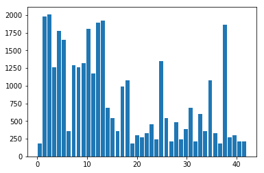
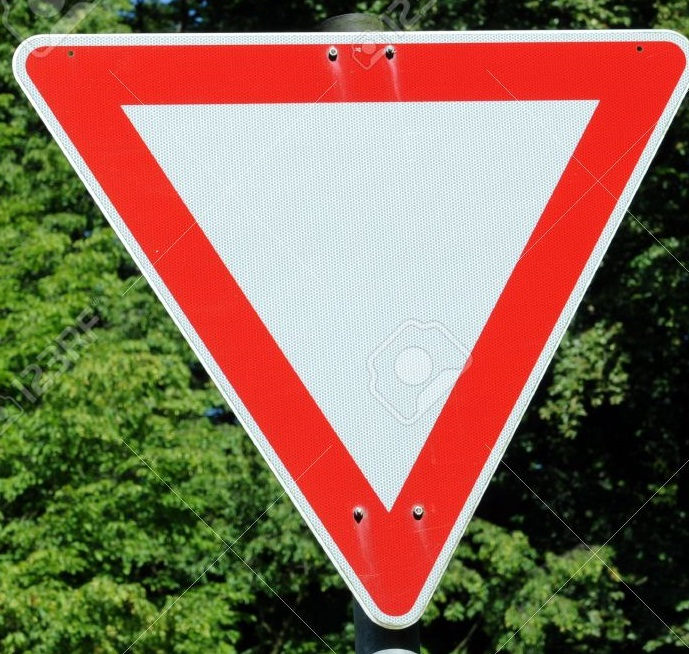
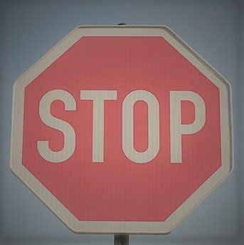
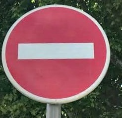

#**Traffic Sign Recognition** 

##Writeup Template

###You can use this file as a template for your writeup if you want to submit it as a markdown file, but feel free to use some other method and submit a pdf if you prefer.

---

**Build a Traffic Sign Recognition Project**

The goals / steps of this project are the following:
* Load the data set (see below for links to the project data set)
* Explore, summarize and visualize the data set
* Design, train and test a model architecture
* Use the model to make predictions on new images
* Analyze the softmax probabilities of the new images
* Summarize the results with a written report

## Rubric Points
###Here I will consider the [rubric points](https://review.udacity.com/#!/rubrics/481/view) individually and describe how I addressed each point in my implementation.  

---
###Writeup / README

####1. Provide a Writeup / README that includes all the rubric points and how you addressed each one. You can submit your writeup as markdown or pdf. You can use this template as a guide for writing the report. The submission includes the project code.

You're reading it! and here is a link to my [project code](https://github.com/aneesh3108/Udacity-SDCND/blob/master/CarND-Traffic-Sign-Classifier-Project-master/Traffic_Sign_Classifier.ipynb)

###Data Set Summary & Exploration

####1. Provide a basic summary of the data set. In the code, the analysis should be done using python, numpy and/or pandas methods rather than hardcoding results manually.

I used the pandas library to calculate summary statistics of the traffic
signs data set:

* The size of training set is - 34799
* The size of the validation set is - 4410
* The size of test set is - 12630
* The shape of a traffic sign image is - 32 x 32 x 3
* The number of unique classes/labels in the data set is - 43

####2. Include an exploratory visualization of the dataset.

Here is an exploratory visualization of the data set. It is a bar chart showing how the unbalanced data distribution in the German Traffic Signs Dataset.

###Design and Test a Model Architecture

####1. Describe how you preprocessed the image data. What techniques were chosen and why did you choose these techniques? Consider including images showing the output of each preprocessing technique. Pre-processing refers to techniques such as converting to grayscale, normalization, etc. (OPTIONAL: As described in the "Stand Out Suggestions" part of the rubric, if you generated additional data for training, describe why you decided to generate additional data, how you generated the data, and provide example images of the additional data. Then describe the characteristics of the augmented training set like number of images in the set, number of images for each class, etc.)

As a first step, I decided to convert the images to grayscale because given the images in the dataset, color information was not really a necessity and that would in turn save the number of parameters required. 

As a second step, I normalized the image data to have values between ([-1, 1]) as input to the CNN network by calculating the overall mean and standard deviation and subtracting, dividing them througout.

####2. Describe what your final model architecture looks like including model type, layers, layer sizes, connectivity, etc.) Consider including a diagram and/or table describing the final model.

My final model consisted of the following layers:

| Layer         		|     Description	        					| 
|:---------------------:|:---------------------------------------------:| 
| Input         		| 32x32x1 Grayscale image   							| 
| Convolution 5 x 5     	| 1x1 stride, valid padding, outputs 28x28x32 	|
| RELU					|												|
| Max pooling	      	| 2x2 stride,  outputs 14x14x32 				|
| Convolution 5 x 5	    | 1x1 stride, valid padding, outputs 10x10x32      									|
| RELU					|												|
| Max pooling	      	| 2x2 stride,  outputs 5x5x32 				|
| Convolution 5 x 5	    | 1x1 stride, valid padding, outputs 1x1x800      									|
| RELU					|												|
| Fully connected		| Takes flattened outputs from Conv 2 post max pooling & Conv 3 - total size 1600						|
| Fully connected		| 1600 --> 500						|
| Fully connected		| 500 --> 100						|
| Fully connected		| 100 --> 43						|
| Softmax				| Final Output     									|

####3. Describe how you trained your model. The discussion can include the type of optimizer, the batch size, number of epochs and any hyperparameters such as learning rate.

To train the model, I used standard cross-entropy loss and Adam Optimizer with a learning rate of 0.0009
Obtaining the learnign rate took quite a debugging since standard conventional learning rates from 0.1 to 0.0001 weren't really working well. I then set a small for loop for 10 epochs each to vary the lr from [0.001 to 0.00001] in units of 0.001 till finally obtaining and concluding on 0.0009. 
The final number of epochs was kept to 50 as anything above 50 didn't really improve the performance and it seemed a steady number during multiple tries. A batch size of 100 was used. I figured having batch size > 50 would be essential since that would, on an ensemble level, ensure that the network sees enough variations amongst 43 classes of images. A few tweaking from 50 in additions of 10 led to a batch size of 100 before my GPU started throwing memory allocation errors. 
To summarize, the following parameters were used: 
Lr            = 0.0009
Loss          = Cross-entropy
Batch size    = 100
Final epochs  = 50

####4. Describe the approach taken for finding a solution and getting the validation set accuracy to be at least 0.93. Include in the discussion the results on the training, validation and test sets and where in the code these were calculated. Your approach may have been an iterative process, in which case, outline the steps you took to get to the final solution and why you chose those steps. Perhaps your solution involved an already well known implementation or architecture. In this case, discuss why you think the architecture is suitable for the current problem.

As per the guidelines, I started off with using the basic LeNet architechture. It was good, and with a few tweakings, gave an accuracy good enough to pass the validation set standard required - however, a small visualization of softmax probabilities showed that the network wasn't really confident when it came to dealing images with speed limits and the ones displayed in my report i.e. the softmax probabilities were varying and the network wasn't fully confident of its score.

To fix that, I initially thought of using ResNet level architechtures but a quick realization led to the fact that the chances of having a model with that many parameters would require high memory level in SDC and hence, tried to keep the parameters limited. As a result, I increased the number of filters learnt and added an extra convolution layer that acted more as a global average pooling layer. I then used the result from the max-pooled conv 2 layer with the global average layer's output as inputs to the FC layer 1. 

I experimented with using outputs from pre-max pool conv 2 and conv 1 layers as well, but since the architecture isn't really that deep, there isn't much of a difference in features learnt and hence, to avoid increasing the input params to the first fully connected layer, I limited it to just the two inputs used. 

I refrained from using dropout/ batch norm here since I didn't feel the need to use them due to a "relatively less deep" network that I used. 

Overall, I figured going directly from 1600 features to 43 would be one big task and hence gradually learnt a descent that went from 1600 -> 500 -> 100 -> 43. This, instead of direct 1600 -> 43, kicked up the accuracies in validation and testing by roughly 2.4 % - which is considerably huge since we already crossed the 93 % mark. 

My final model results were:
* training set accuracy of 100%
* validation set accuracy of 96.4%
* test set accuracy of 95.3%
###Test a Model on New Images

####1. Choose five German traffic signs found on the web and provide them in the report. For each image, discuss what quality or qualities might be difficult to classify.

Here are five German traffic signs that I found on the web:

What's new about these images? 
Well, the first 2 images - I took them off Shutterstock and they come with the watermark. I was curious about if it would cause a problem in classfying (act as noise)

Image 3 - It's just very blurred, then again - the whole dataset is 32 x 32. No surprises there. 

Image 4 & 5 - I took them off Google search and modified them - the stop sign has a small overlap of white stripes that is fairly visible in the image while the other sign has gaussian noise added to it. I was curious as to how the network will react to such "adversaries" 

####2. Discuss the model's predictions on these new traffic signs and compare the results to predicting on the test set. At a minimum, discuss what the predictions were, the accuracy on these new predictions, and compare the accuracy to the accuracy on the test set 

Surprisingly, the model was correctly able to guess all 5 signs (with 100% accuracy) even though they had sufficiently less representation in the training dataset. 

####3. Describe how certain the model is when predicting on each of the five new images by looking at the softmax probabilities for each prediction. Provide the top 5 softmax probabilities for each image along with the sign type of each probability. (OPTIONAL: as described in the "Stand Out Suggestions" part of the rubric, visualizations can also be provided such as bar charts)

The code for finding softmax probabilities on my final model is located in the 22nd cell of the Ipython notebook.

For all images, the model is perfectly sure its classifying the image perfectly. 

